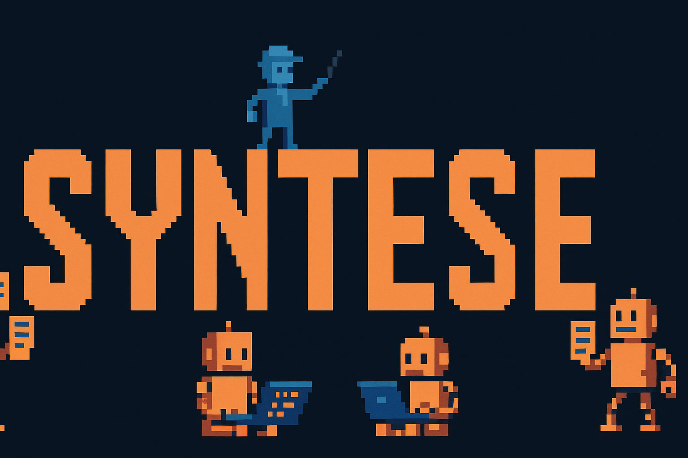
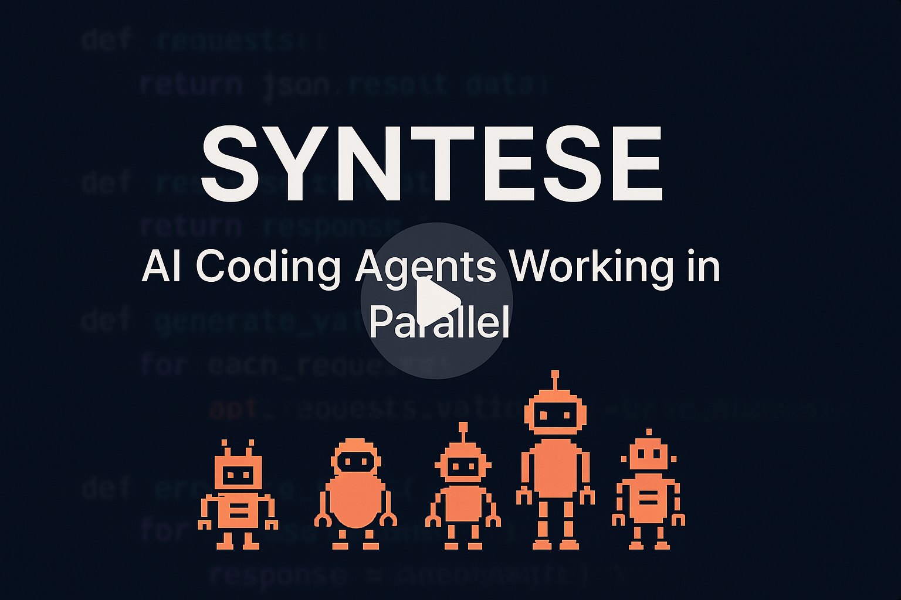
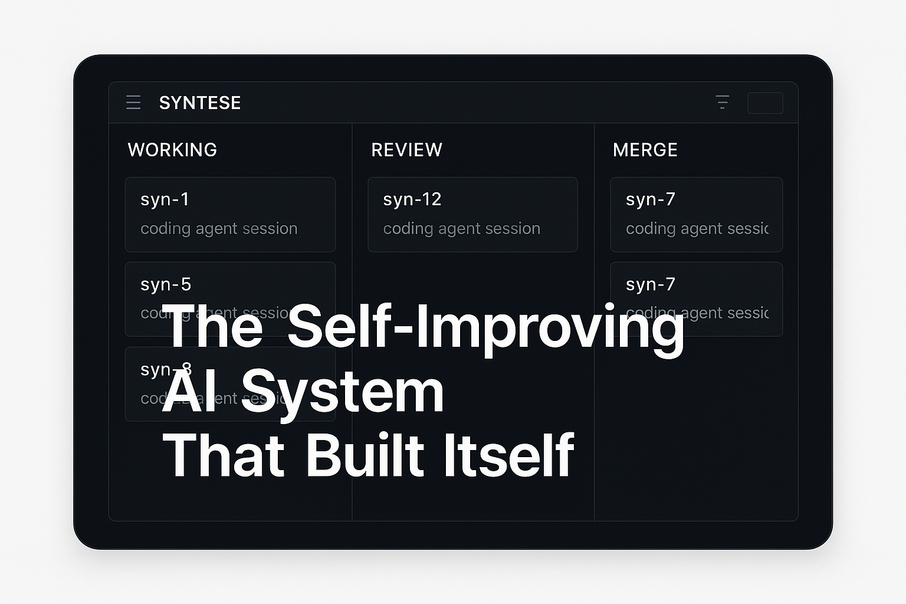

<h1 align="center">Syntese — The Orchestration Layer for Parallel AI Agents</h1>

<p align="center">
  
</p>

<div align="center">

Spawn parallel AI coding agents, each in its own git worktree. Agents autonomously fix CI failures, address review comments, and open PRs — you supervise from one dashboard.

[](https://github.com/sigvardt/syntese/stargazers)
[](LICENSE)
[](https://github.com/sigvardt/syntese/pulls?q=is%3Amerged)
[](https://github.com/sigvardt/syntese/releases/tag/metrics-v1)
[](https://discord.gg/P9BytfBj)

</div>

---

Syntese manages fleets of AI coding agents working in parallel on your codebase. Each agent gets its own git worktree, its own branch, and its own PR. When CI fails, the agent fixes it. When reviewers leave comments, the agent addresses them. You only get pulled in when human judgment is needed.

Use `syn` as the primary CLI command. `syntese` and `ao` are also available as aliases.

**Agent-agnostic** (Claude Code, Codex, Aider) · **Runtime-agnostic** (tmux, Docker) · **Tracker-agnostic** (GitHub, Linear)

<div align="center">

## See it in action

<a href="https://x.com/agent_wrapper/status/2026329204405723180">
  
</a>
<br><br>
<a href="https://x.com/agent_wrapper/status/2026329204405723180"></a>
<br><br><br>
<a href="https://x.com/agent_wrapper/status/2025986105485733945">
  
</a>
<br><br>
<a href="https://x.com/agent_wrapper/status/2025986105485733945"></a>

</div>

## Quick Start

**Option A — From a repo URL (fastest):**

```bash
# Install
git clone https://github.com/sigvardt/syntese.git
cd syntese && bash scripts/setup.sh

# One command to clone, configure, and launch
syn start https://github.com/your-org/your-repo
```

Auto-detects language, package manager, SCM platform, and default branch. Generates `syntese.yaml` and starts the dashboard + orchestrator.
On supported hosts, `syn start` also brings up the supervised dashboard services automatically. Use `syn services status --strict` to confirm dashboard and websocket readiness.

**Option B — From an existing local repo:**

```bash
cd ~/your-project && syn init --auto
syn start
```

Then spawn agents:

```bash
syn spawn my-project 123    # GitHub issue, Linear ticket, or ad-hoc
```

Dashboard opens at `http://localhost:3000`. Run `syn status` for the CLI view.

For resilient dashboard + terminal websocket uptime (including XDA terminal connectivity), install supervised services:

```bash
syn services install
syn services status
```

## How It Works

```
syn spawn my-project 123
```

1. **Workspace** creates an isolated git worktree with a feature branch
2. **Runtime** starts a tmux session (or Docker container)
3. **Agent** launches Claude Code (or Codex, or Aider) with issue context
4. Agent works autonomously — reads code, writes tests, creates PR
5. **Reactions** auto-handle CI failures and review comments
6. **Notifier** pings you only when judgment is needed

### Plugin Architecture

Eight slots. Every abstraction is swappable.

| Slot | Default | Alternatives |
|------|---------|-------------|
| Runtime | tmux | docker, k8s, process |
| Agent | claude-code | codex, aider, opencode |
| Workspace | worktree | clone |
| Tracker | github | linear |
| SCM | github | — |
| Notifier | desktop | slack, webhook |
| Terminal | iterm2 | web |
| Lifecycle | core | — |

All interfaces defined in [`packages/core/src/types.ts`](packages/core/src/types.ts). A plugin implements one interface and exports a `PluginModule`. That's it.

## Configuration

```yaml
# syntese.yaml
port: 3000

defaults:
  runtime: tmux
  agent: claude-code
  workspace: worktree
  notifiers: [desktop]

projects:
  my-app:
    repo: owner/my-app
    path: ~/my-app
    defaultBranch: main
    sessionPrefix: app
    scm:
      plugin: github
      mergeMethod: squash   # merge | squash | rebase
    verification:
      postPush:
        command: npm run verify:live
        timeout: 120
        failAction: block-merge
      evidence:
        required: true
        patterns:
          - docs/.verify-evidence-*

reactions:
  ci-failed:
    auto: true
    action: send-to-agent
    retries: 2
  changes-requested:
    auto: true
    action: send-to-agent
    escalateAfter: 30m
  approved-and-green:
    auto: false
    action: notify
```

CI fails → agent gets the logs and fixes it. Reviewer requests changes → agent addresses them. PR approved with green CI → you get a notification to merge.

If a project needs live verification beyond CI, `verification.postPush` runs a project-defined command after each new pushed `HEAD`. `block-merge` prevents auto-merge and the dashboard merge action until that verification passes.

See [`syntese.yaml.example`](syntese.yaml.example) for the full reference.

## CLI

```bash
syn status                              # Overview of all sessions
syn spawn <project> [issue]             # Spawn an agent
syn send <session> "Fix the tests"      # Send instructions
syn session ls                          # List sessions
syn session kill <session>              # Kill a session
syn session restore <session>           # Revive a crashed agent
syn dashboard                           # Open web dashboard (dev mode)
syn services install|start|stop|status  # Supervised dashboard/ws runtime
```

`syntese` and `ao` are also available as command aliases.

## Supervised Runtime (Recommended)

`syn services` runs and monitors all three runtime endpoints:

- dashboard web server (`3000`)
- terminal websocket server (`14800`)
- direct terminal websocket server (`14801`, used for XDA-capable terminal mode)

Use this for normal operation instead of ad-hoc `pnpm dev` shell processes:

```bash
# One-time setup (installs systemd user services on Linux, fallback supervisor elsewhere)
syn services install

# Check readiness for dashboard + XDA websocket backends
syn services status --strict
```

## Why Syntese?

Running one AI agent in a terminal is easy. Running 30 across different issues, branches, and PRs is a coordination problem.

**Without orchestration**, you manually: create branches, start agents, check if they're stuck, read CI failures, forward review comments, track which PRs are ready to merge, clean up when done.

**With Syntese**, you: `syn spawn` and walk away. The system handles isolation, feedback routing, and status tracking. You review PRs and make decisions — the rest is automated.

## Prerequisites

- Node.js 20+
- Git 2.25+
- tmux (for default runtime)
- `gh` CLI (for GitHub integration)

## Development

```bash
pnpm install && pnpm build    # Install and build all packages
pnpm test                      # Run tests (3,288 test cases)
pnpm dev                       # Start the foreground dev dashboard stack
```

See [CLAUDE.md](CLAUDE.md) for code conventions and architecture details.

## Documentation

| Doc | What it covers |
|-----|---------------|
| [Setup Guide](SETUP.md) | Detailed installation and configuration |
| [Examples](examples/) | Config templates (GitHub, Linear, multi-project, auto-merge) |
| [CLAUDE.md](CLAUDE.md) | Architecture, conventions, plugin pattern |
| [Troubleshooting](TROUBLESHOOTING.md) | Common issues and fixes |

## Contributing

Contributions welcome. The plugin system makes it straightforward to add support for new agents, runtimes, trackers, and notification channels. Every plugin is an implementation of a TypeScript interface — see [CLAUDE.md](CLAUDE.md) for the pattern.

## License

MIT
